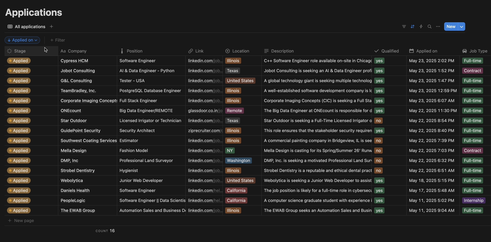

# AI-Powered Job Application Tracker

Transform your job search with an automated, AI-driven pipeline that captures every detail of your application and logs it directly into Notion, no manual data entry required.

## Features
* One‑Click Apply: Simply hit Apply and watch our AI agent extract the information about job and post it in your Notion database
* Application status (Applied, Interview, Offer, Waitlist, Rejected)
* Real‑Time Updates: Your Notion “Applications” board updates instantly as emails arrive.
* Multi‑Board Support: Works with LinkedIn, Glassdoor, ZipRecruiter, Indeed, and more.
* Scalable: Perfect for solo job‑seekers or high‑volume hiring teams.
* No Copy‑Paste: Fully automated data capture via email triggers and parsing.

<p float="left">
  
  
</p>

## Tech Stack
* n8n: Workflow automation engine
* Notion: Centralized job‑tracker database
* OpenAI API: NLP extraction and prompt‑driven parsing
* SerpAPI: Job metadata enrichment (100 free searches/month)
* Gmail: Email trigger for applied‑job notifications

## Prerequisites
* A free OpenAI API key
* A free SerpAPI key
* A Notion account with a Job Application Tracker database (or duplicate the template)
* An n8n account
* Access to your job‑alert emails (LinkedIn, ZipRecruiter, Indeed, Glassdoor)

##  Installation & Setup
* Clone the Repo
```
git clone https://github.com/LALITH0110/job-tracker.git
cd job-tracker
```
* Prepare Notion
  * Duplicate the free Job Application Tracker template (From the video) .
  * Open the table, click ••• → Copy page URL, and save the ID.
  * Ensure your database has the desired fields (Company, Role, Link, Location, Salary, Status, etc.).
* Import Workflow into n8n
  * Log in to your n8n account at n8n.io.
  * Create a new workflow → ••• → Import from file → upload job-tracker.workflow.json.
* Configure Credentials
  * In n8n, double‑click each errored node (Gmail, OpenAI, SerpAPI, Notion) and enter:
    * Gmail OAuth credentials
    * OpenAI API key
    * SerpAPI API key
    * Notion Integration token & database ID
  * Save until no errors remain.
* Adjust Field Mappings
  * If Notion node errors persist, verify column names in your database match the workflow mappings.
