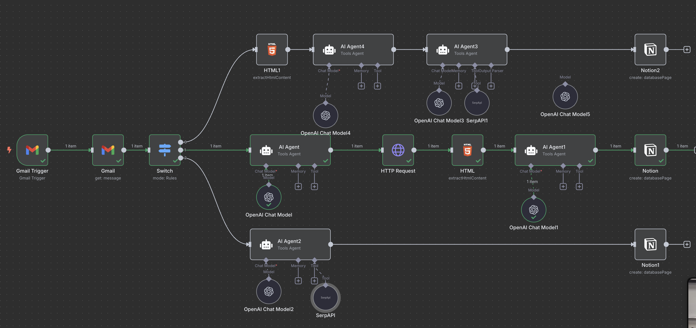

# AI-Powered Job Application Tracker

Transform your job search with an automated, AI-driven pipeline that captures every detail of your application and logs it directly into Notion—no manual data entry required.

## Features
* One‑Click Apply: Simply hit Apply and watch our AI agent extract the information about job and post it in your Notion database
* Application status (Applied, Interview, Offer, Waitlist, Rejected)
* Real‑Time Updates: Your Notion “Applications” board updates instantly as emails arrive.
* Multi‑Board Support: Works with LinkedIn, Glassdoor, ZipRecruiter, Indeed, and more.
* Scalable: Perfect for solo job‑seekers or high‑volume hiring teams.
* No Copy‑Paste: Fully automated data capture via email triggers and parsing.

  
  

## Tech Stack
* n8n: Workflow automation engine
* Notion: Centralized job‑tracker database
* OpenAI API: NLP extraction and prompt‑driven parsing
* SerpAPI: Job metadata enrichment (100 free searches/month)
* Gmail: Email trigger for applied‑job notifications

## Prerequisites
* A free OpenAI API key
* A free SerpAPI key
* A Notion account with a Job Application Tracker database (or duplicate the template)
* An n8n account
* Access to your job‑alert emails (LinkedIn, ZipRecruiter, Indeed, Glassdoor)
